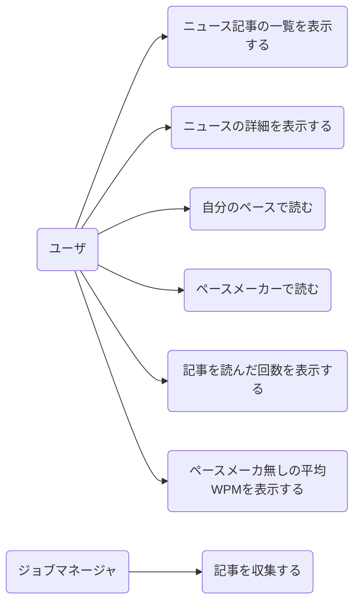
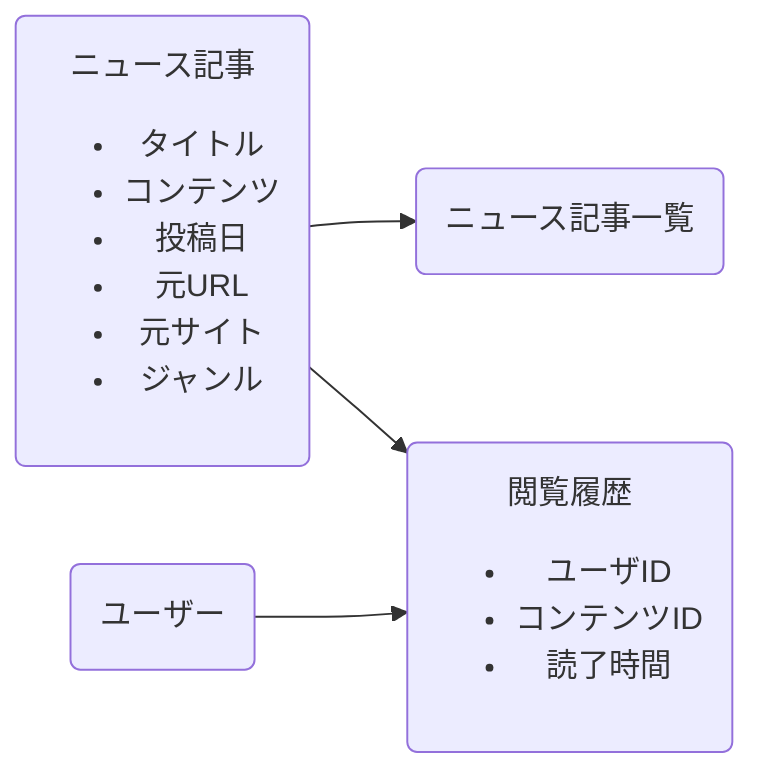

英語deニュース!
=============================

Usecase
-----------------------

```mermaid
graph LR
    acter1(ユーザ);
    acter2(ジョブマネージャ);
    acter1 --> case1(ニュース記事の一覧を表示する);
    acter1 --> case2(ニュースの詳細を表示する);
    acter1 --> case3(自分のペースで読む);
    acter1 --> case4(ペースメーカーで読む);
    acter1 --> case5(記事を読んだ回数を表示する);
    acter1 --> case6(ペースメーカ無しの平均WPMを表示する);
    acter2 --> case7(記事を収集する);

```

Data Model
------------------------

```mermaid
graph LR
    news(ニュース記事<ul><li>タイトル</li><li>コンテンツ</li><li>投稿日</li><li>元URL</li><li>元サイト</li><li>ジャンル</li></ul>);
    newsList(ニュース記事一覧<br/>);
    user(ユーザー);
    history(閲覧履歴<ul><li>ユーザID</li><li>コンテンツID</li><li>読了時間</li></ul>);

    news --> newsList;
   	news --> history;
    user --> history;
```